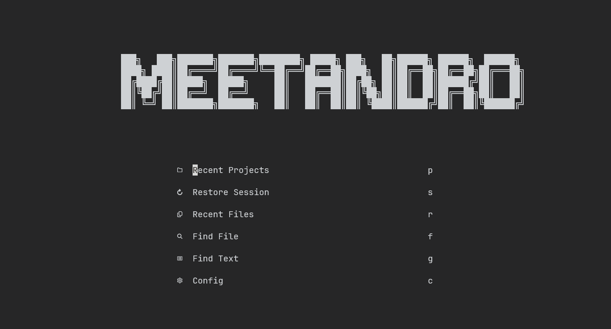
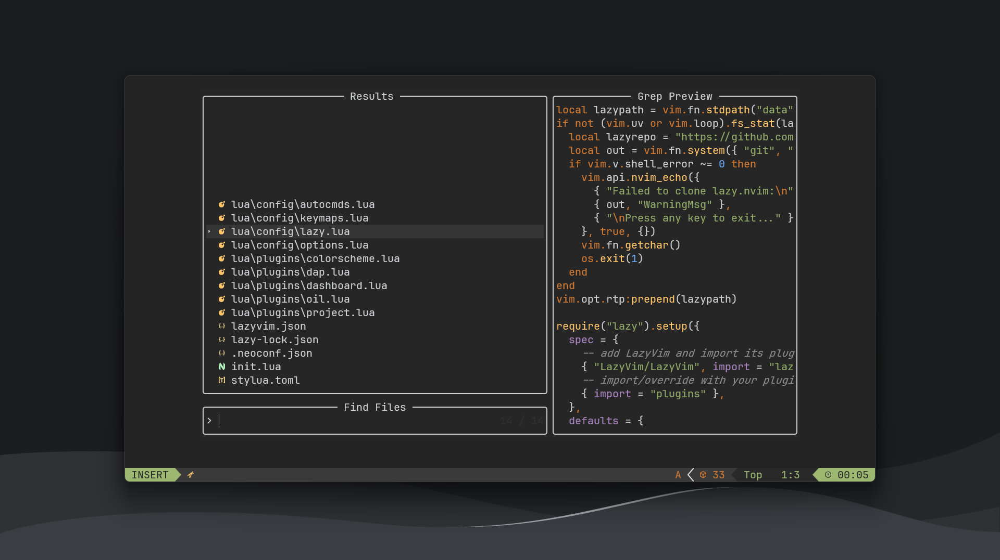
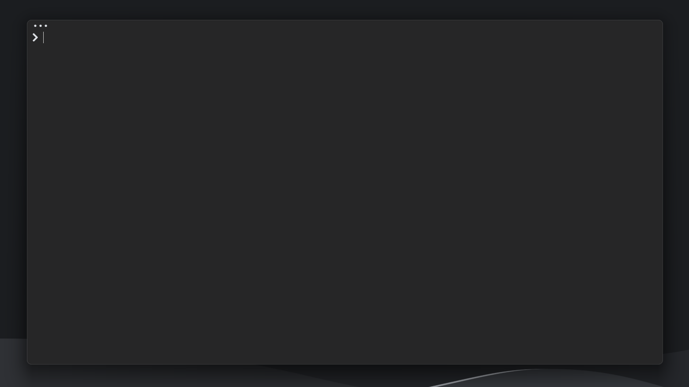

## Box Contents

- Neovim config
- PowerShell config
- Git config

## Dependencies

- [PowerShell](https://apps.microsoft.com/detail/9mz1snwt0n5d?hl=en-us&gl=US) (modules list below)
  - [z](https://www.powershellgallery.com/packages/z/1.1.9)
  - [Terminal Icons](https://www.powershellgallery.com/packages/Terminal-Icons/0.9.0)
  - [PSReadLine](https://www.powershellgallery.com/packages/PSReadLine/2.1.0)
- [Scoop](https://scoop.sh/) (buckets list below)
  - [starship](https://starship.rs/) (prompt)
  - lazygit
  - neovim
  - winfetch
  - gcc & nodejs-lts (for neovim)
  - ripgrep & fd (for searching)
  - 7zip
- [Git](https://git-scm.com/)

## Appendix

The Neovim config is built on top of the [LazyVim](https://www.lazyvim.org/) setup.

It is also important to note that a [nerd font](https://www.nerdfonts.com/) is required for nearly anything to visually appear.
