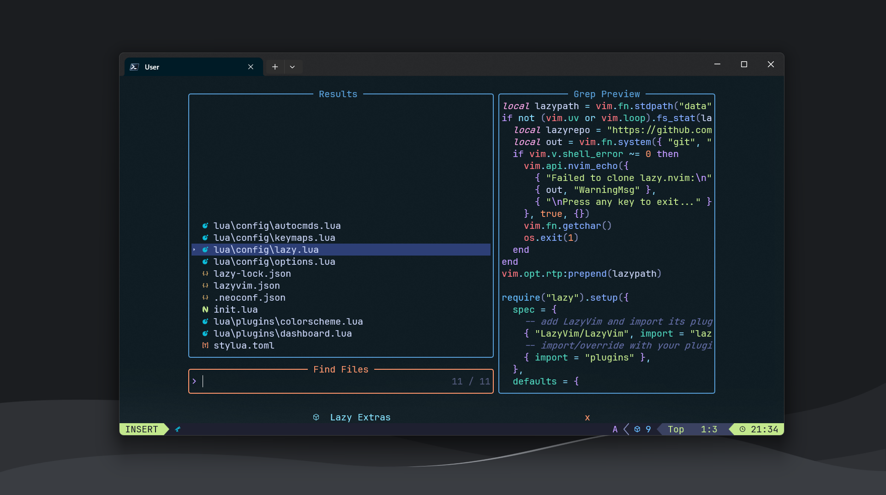
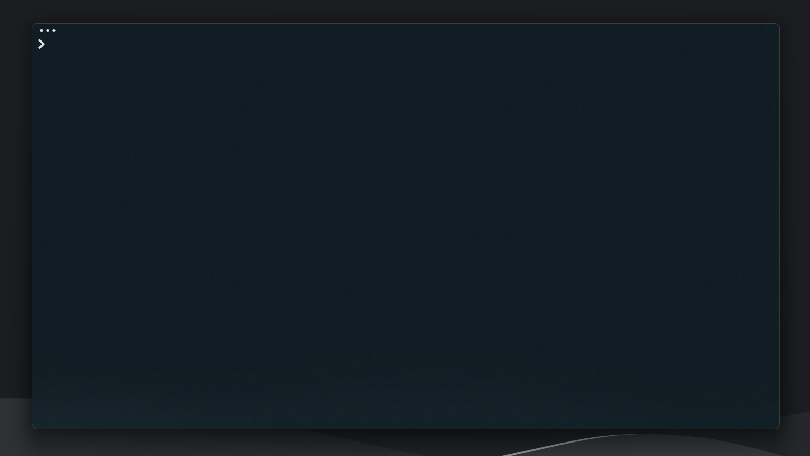

## Box Contents

- Neovim config
- PowerShell config
- Starship config
- Git config
- PowerShell & Scoop setup scripts

## Appendix

The Neovim config is built on top of the [LazyVim](https://www.lazyvim.org/) setup.

It is also important to note that a [nerd font](https://www.nerdfonts.com/) is required for nearly anything to visually appear.
